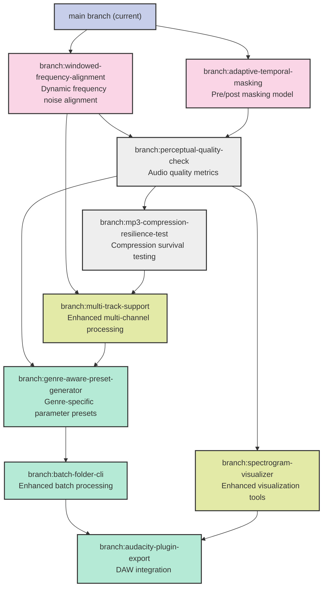

# HarmonyDagger Feature Branch Visualization

This diagram illustrates the planned feature branches for HarmonyDagger, showing implementation dependencies and relationships.

## Branch Implementation Sequence

## Feature Categories

- **Core Algorithm Improvements** (pink): Fundamental enhancements to noise injection methods
- **Quality & Analysis** (gray): Features that measure and ensure effectiveness
- **File Handling & Visualization** (light green): Support for different audio formats and better visualization
- **User Experience & Distribution** (mint): Features that improve usability and adoption

## Implementation Timeline Considerations

1. Core algorithm improvements should be implemented first as they affect all other features
2. Quality metrics are needed next to validate the effectiveness of protection
3. File handling and visualization features enhance usability
4. User experience features like presets and batch processing streamline workflows
5. The Audacity plugin should be developed last to incorporate all other features

## Dependencies Explained

- **Perceptual quality check** depends on core algorithm improvements to measure their effectiveness
- **MP3 compression resilience test** builds on quality metrics
- **Multi-track support** benefits from both frequency alignment and compression testing
- **Genre-aware presets** require quality metrics and multi-track support
- **Batch folder CLI** builds on genre presets for more effective batch processing
- **Audacity plugin** incorporates batch processing capabilities and visualization tools
